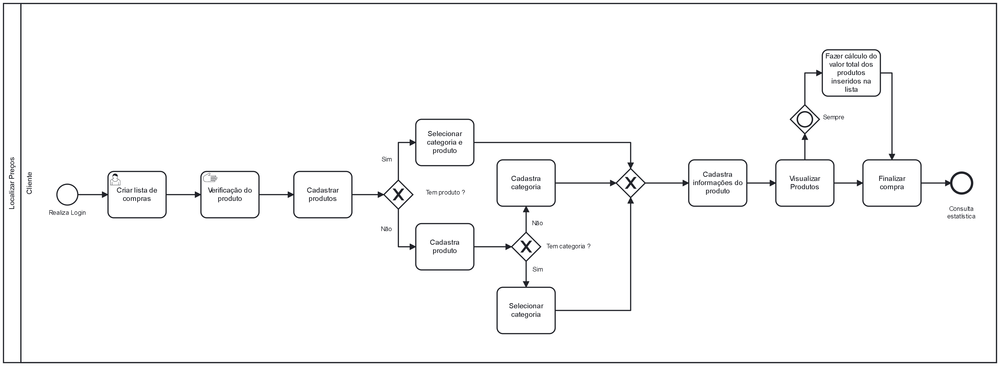
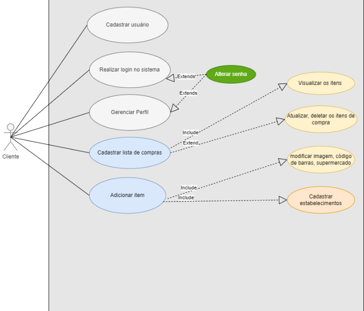
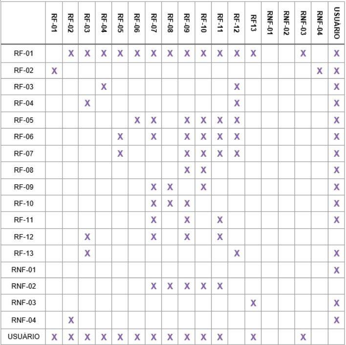
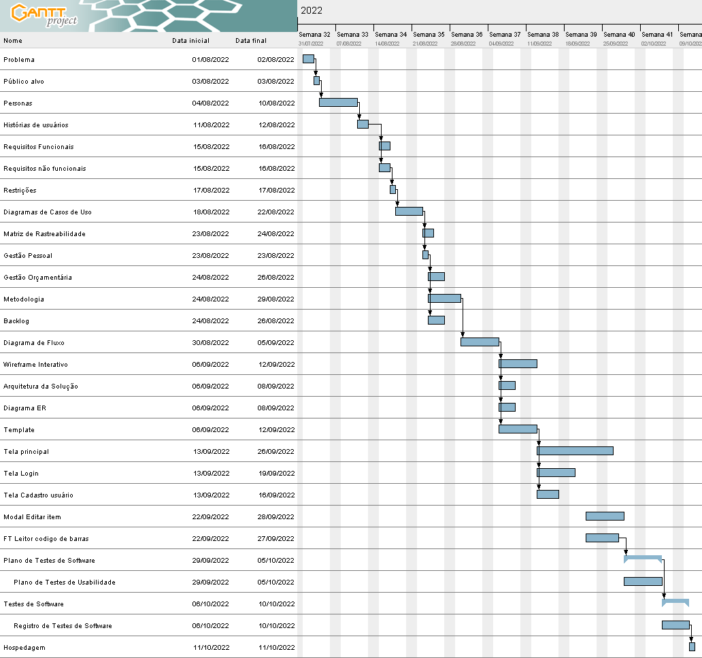
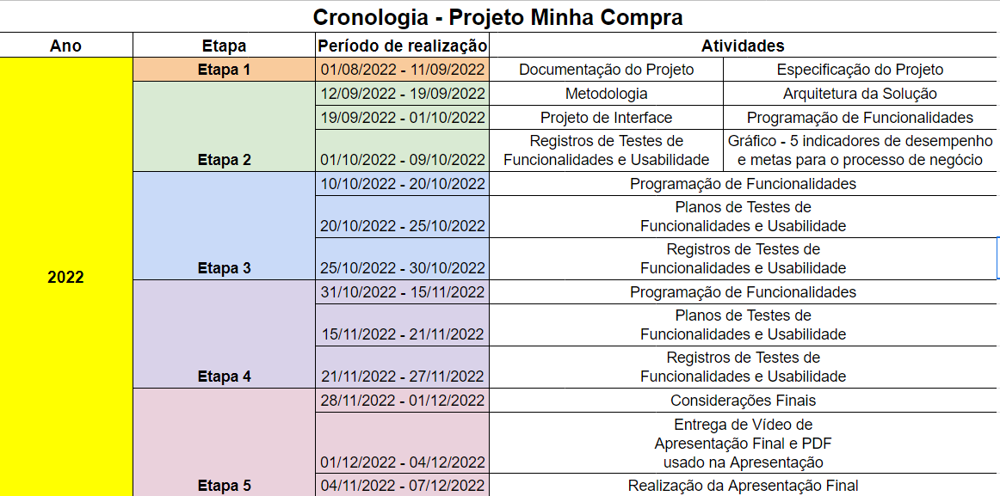

# Especificações do Projeto

A definição exata do problema e os pontos mais relevantes a serem tratados neste projeto foi consolidada com a participação dos usuários em um trabalho de imersão, feito pelos membros da equipe a partir da observação dos usuários em seu local natural e por meio de entrevistas. Os detalhes levantados nesse processo foram consolidados na forma de personas e histórias de usuários.

## Personas

As personas levantadas durante o processo de entendimento do problema são apresentadas no quadro abaixo:

|BEATRIZ SILVA            |                                                                            |                                       |
|-------------------------|----------------------------------------------------------------------------|---------------------------------------|
|**Informações Pessoais** | _Idade_: 34                                                                | _Ocupação_: Assistente administrativo |
|**Aplicativos**          | Zoom                                                                       | Buscapé                               |
|**Motivações**           | Economizar tempo                                                           | Economizar Dinheiro                   |
|**Frustrações**          | Pouco tempo para a família e hobbies                                       | Produtos caros                        | 
|**História**             | Sócia de um pequeno escritório que atua em processos de fusões de empresas |                                       |

|ANTÔNIO AUGUSTO          |                                                                            |                                       |
|-------------------------|----------------------------------------------------------------------------|---------------------------------------|
|**Informações Pessoais** | _Idade_: 45                                                                | _Ocupação_: Vendedor autônomo         |
|**Aplicativos**          | Oferta Esperta                                                             | Mercado Livre                         |
|**Motivações**           | Maior lucro na revenda de produtos                                         | Economizar tempo                      |
|**Frustrações**          | Perder tempo indo em diversos mercados                                     | Baixo lucro em sua loja               | 
|**História**             | Dono de uma pequena venda de bairro                                        |                                       |

## Histórias de Usuários

A partir da compreensão do dia a dia das personas identificadas para o projeto, foram registradas as seguintes histórias de usuários:

|EU COMO... `PERSONA`| QUERO/PRECISO ... `FUNCIONALIDADE`                                          | PARA ... `MOTIVO/VALOR`                                      |
|--------------------|-----------------------------------------------------------------------------|--------------------------------------------------------------|
|Beatriz Silva       | Economizar tempo                                                            | Passar mais tempo com a família                              |
|Beatriz Silva       | Economizar dinheiro                                                         | Poder quitar dívidas/investir em lazer                       |
|Beatriz Silva       | Comodidade de fazer comparações de valores de produtos de casa              | Poder descansar e ser objetiva na hora de fazer suas compras |
|Antônio Augusto     | Comparar valores diferentes do mesmo produto de forma mais abrangente       | Gastar menos e obter uma maior taxa de lucro                 |
|Antônio Augusto     | Comparar o que gastou no mês atual e no mês passado de forma simples        | Analisar as estatísticas para ver se pode melhorar seu lucro |
|Antônio Augusto     | Economizar tempo                                                            | Gastar a energia em formas de expandir o seu negócio         |

## Modelagem do Processo de Negócio 

### Análise da Situação Atual

Cliente loga no App Minha Compra; Cria sua lista de produtos e vai em cadastar produto. Se o produto escolhido já existir no banco de dados do app, ele seleciona sua categoria e segue para cadastrar as informações adicionais do produto, se não, o cliente cadastra o produto e seleciona sua categoria. Se não houver categoria, também é feito o cadastro de mesma. Chegando no fluxo final, ele consegue visualizar sua lista de produtos e finalizar sua compra. O aplicativo também já retorna o valor total da lista e uma breve estatística. 

### Processo 1 – Comparação entre listas

Após o cliente criar a lista de produtos, o app faz uma comparação através de uma estatística, entre os produtos de sua lista atual.

## Indicadores de Desempenho

A tabela a seguir apresenta os principais indicadores de desempenho e algumas metas para o processo. 

## Requisitos

O escopo funcional do projeto é definido por meio dos requisitos funcionais que descrevem as possibilidades interação dos usuários, bem como os requisitos não funcionais que descrevem os aspectos que o sistema deverá apresentar de maneira geral. Estes requisitos são apresentados a seguir.

### Requisitos Funcionais

|ID    | Descrição do Requisito  | Prioridade |
|------|-----------------------------------------|----|
|RF-001| O aplicativo deve permitir ao usuário cadastrar,atualizar e visualizar os seus dados | ALTA | 
|RF-002| O aplicativo deve permitir ao usuário logar/deslogar da conta.   | ALTA |
|RF-003| O aplicativo deve permitir ao usuário cadastrar novas listas, assim como visualizar, alterar e excluir as listas de compras anteriores.   | ALTA |
|RF-004| O aplicativo deve permitir ao usuário cadastrar, visualizar, atualizar e deletar os itens de sua lista de compras.   | ALTA |
|RF-005| O aplicativo deve permitir ao usuário cadastrar informações de produtos.   | ALTA |
|RF-006| O aplicativo deve permitir ao usuário cadastrar, visualizar e atualizar o preço dos produtos.   | ALTA |
|RF-007| O aplicativo deve exibir um comparativo de preço entre as compras.   | ALTA |

### Requisitos não Funcionais

A tabela a seguir apresenta os requisitos não funcionais que o projeto deverá atender.

|ID     | Descrição do Requisito  |Prioridade |
|-------|-------------------------|----|
|RNF-001| O aplicativo deve ser compatível com smartphones que possuem sistemas operacionais Android e IOS. | ALTA | 
|RNF-002| O aplicativo deve armazenar dados localmente utilizando o banco de dados SQLite.  |  ALTA | 
|RNF-003| O aplicativo deve conter uma boa usabilidade. |  MÉDIA | 
|RNF-004| O aplicativo deve conter modo online/offline. |  ALTA | 

## Restrições

As questões que limitam a execução desse projeto e que se configuram como obrigações claras para o desenvolvimento do projeto em questão são apresentadas na tabela a seguir.

|ID| Restrição                                             |
|--|-------------------------------------------------------|
|01| O projeto deverá ser entregue no final do semestre letivo, não podendo extrapolar a data de 07/12/2022. |
|02| O projeto deverá ser desenvolvido com o framework React-Native.        |
|03| A equipe não pode subcontratar o desenvolvimento do trabalho.          |

## Diagrama de Casos de Uso

O diagrama de casos de uso é o próximo passo após a elicitação de requisitos, que utiliza um modelo gráfico com as descrições sucintas dos casos de uso e dos atores. Ele contempla a fronteira do sistema e o detalhamento dos requisitos funcionais com a indicação dos atores, casos de uso e seus relacionamentos. 

# Matriz de Rastreabilidade

A matriz de rastreabilidade é responsável pela ligação entre requisitos e outros artefatos de interesse para o software, conforme apresentado a seguir:

# Gerenciamento de Projeto

De acordo com o PMBoK v6 as dez áreas que constituem os pilares para gerenciar projetos, e que caracterizam a multidisciplinaridade envolvida, são: Integração, Escopo, Cronograma (Tempo), Custos, Qualidade, Recursos, Comunicações, Riscos, Aquisições, Partes Interessadas. Para desenvolver projetos um profissional deve se preocupar em gerenciar todas essas dez áreas. Elas se complementam e se relacionam, de tal forma que não se deve apenas examinar uma área de forma estanque. É preciso considerar, por exemplo, que as áreas de Escopo, Cronograma e Custos estão muito relacionadas. Assim, se eu amplio o escopo de um projeto eu posso afetar seu cronograma e seus custos.

## Gerenciamento de Tempo

O gráfico de Gantt ou diagrama de Gantt também é uma ferramenta visual utilizada para controlar e gerenciar o cronograma de atividades de um projeto. Com ele, é possível listar tudo que precisa ser feito para colocar o projeto em prática, dividir em atividades e estimar o tempo necessário para executá-las.

## Gerenciamento de Equipe

O gerenciamento adequado de tarefas contribuirá para que o projeto alcance altos níveis de produtividade. Por isso, é fundamental que ocorra a gestão de tarefas e de pessoas, de modo que os times envolvidos no projeto possam ser facilmente gerenciados. 

## Gestão de Orçamento

O processo de determinar o orçamento do projeto é uma tarefa que depende, além dos produtos (saídas) dos processos anteriores do gerenciamento de custos, também de produtos oferecidos por outros processos de gerenciamento, como o escopo e o tempo.

*  Cálculos realizados considerando 500 horas de desenvolvimento
* Cálculos realizados para o primeiro ano de produção, tendo em vista que os valores mensais e anuais de servidores e App Store continuarão a serem cobrados.

