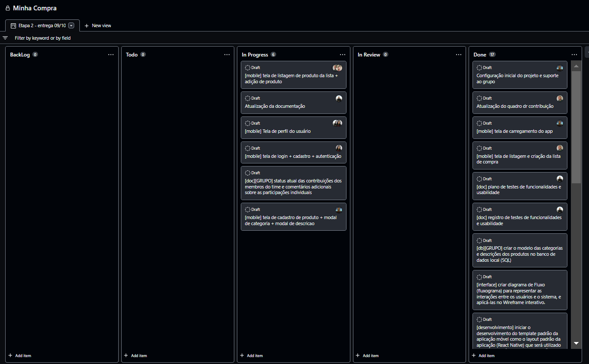

# Metodologia

## Controle de Versão

A ferramenta de controle de versão adotada no projeto foi o
[Git](https://git-scm.com/), sendo que o [Github](https://github.com)
foi utilizado para hospedagem do repositório.

O projeto segue a seguinte convenção para o nome de branches:

- `main`: versão estável já testada do software
- `feature`: uma nova funcionalidade precisa ser introduzida
- `development`: versão de desenvolvimento do software

Quanto à gerência de issues, o projeto adota a seguinte convenção para
etiquetas:

- `doc`: melhorias ou acréscimos à documentação
- `bug`: uma funcionalidade encontra-se com problemas

### Configuração do Projeto

O grupo escolheu utilizar um processo baseado em GitFlow para administrar a gestão do código. Desta forma, é possível separarmos as etapas de cada estágio da evolução e correção do software, mas com cada uma em sua própria branch. Sendo elas: Main, Develop e Feature.

## Gerenciamento de Projeto

|Ambiente                          | Plataforma  | Link de acesso|
|----------------------------------| ----------- | --------------|
|Repositório de código fonte       | GitHub      | <https://github.com/ICEI-PUC-Minas-PMV-ADS/pmv-ads-2022-2-e3-proj-mov-t3-minha-compra> |
|Documentos de Projeto             | GitHub      | <https://github.com/ICEI-PUC-Minas-PMV-ADS/pmv-ads-2022-2-e3-proj-mov-t3-minha-compra/tree/main/docs> |
|Projeto de interface e Wireframes | Pendente    | <https://github.com/ICEI-PUC-Minas-PMV-ADS/pmv-ads-2022-2-e3-proj-mov-t3-minha-compra> |
|Gerenciamento do Projeto          | GitHub      | <https://github.com/orgs/ICEI-PUC-Minas-PMV-ADS/projects/124> |

### Divisão de Papéis

A escolha do grupo para o gerenciamento do projeto foi a metodologia ágil Scrum.

A equipe está organizada da seguinte maneira:
* Scrum Master: Mateys Curcino De Lima
* Equipe de Desenvolvimento:
    * Pedro Henrique da Silva Góis
    * Kaio Henrik de Paula Silva
    * Meriane dos Reis Dias
    * Bruno Carolino Lopes
    * Thiago Roberto de Souza 
    * Jhonata Jackson Monteiro Motta 

Para organização e distribuição das tarefas do projeto, a equipe está utilizando o Trello estruturado com as seguintes listas:
* Backlog: recebe as tarefas a serem trabalhadas e representa o Product Backlog. 
Todas as atividades identificadas no decorrer do projeto também devem ser incorporadas a esta lista.
* To Do: Esta lista representa o Sprint Backlog. Este é o Sprint atual que estamos trabalhando.
* In Progress: Quando uma tarefa tiver sido iniciada, ela é movida para cá.
* In Review: Checagem de Qualidade. É nesta etapa que damos um double check para verificar que a funcionalidade está estável.
* Done: nesta lista são colocadas as tarefas que passaram pelos testes e controle de qualidade e estão prontos para ser entregues ao usuário. Não há mais edições ou revisões necessárias, ele está agendado e pronto para a ação.

O quadro kanban está disponível através da URL <https://github.com/orgs/ICEI-PUC-Minas-PMV-ADS/projects/124>

### Processo

O plano de sprint utilizado para guiar o grupo foi utilizado seguindo o sugerido pela própria instituição da PUC, conforme mostrado abaixo:

Após ter sido feita a análise das informações acima, criamos todo o gerenciamento do projeto no Trello, conforme mostrado abaixo:

### Ferramentas

As ferramentas empregadas no projeto são:

- Editor de código: Visual Studio Code;
- Ferramentas de comunicação: Telegram, Whatsapp e Discord;
- Ferramenta para Gerenciamento do Projeto: GitHub Projetcs;
- Ferramenta para Criação do Wireframe: Pendente;
- Ferramentas para Criação de Diagramas: Miro;

Todas as ferramentas selecionadas pelo grupo para resolver problemas foram escolhidas por ter uma compatibilidade com o mercado e ser de fácil acesso para todos, visando entregar valor para o usuário final. Selecionamos ferramentas que já são familiares em certos aspectos, e de formas diferentes, para cada membro do grupo.

 

## Quadro Visual Atual de Gestão de Trabalho/ Status Atual das Contribuições dos Membros do Time

<li><a href="https://github.com/orgs/ICEI-PUC-Minas-PMV-ADS/projects/124/views/1"> Quadro atual - ETAPA 4</a></li>  
