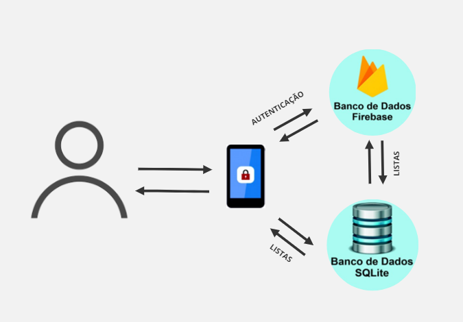
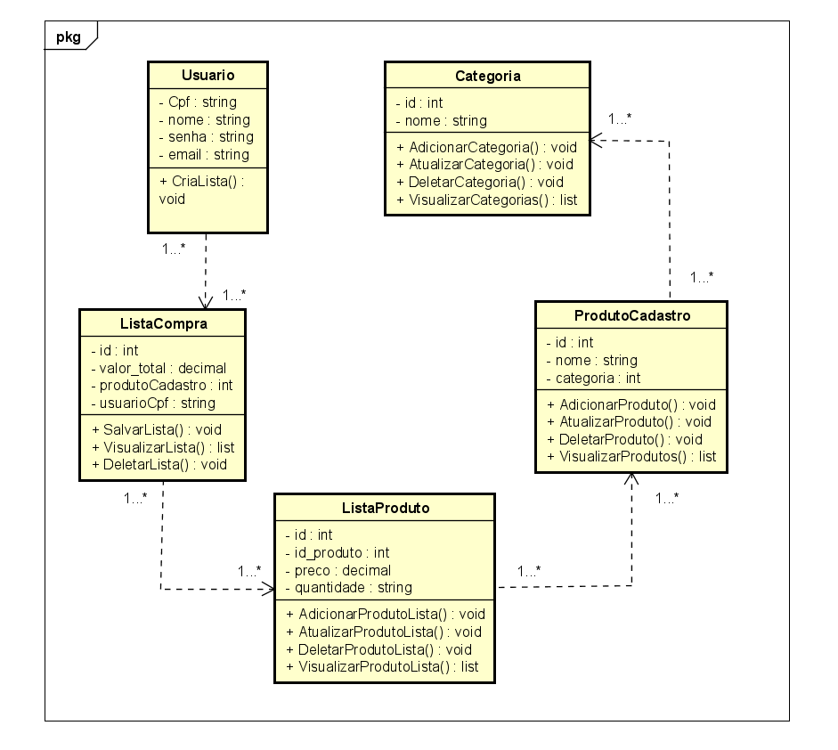
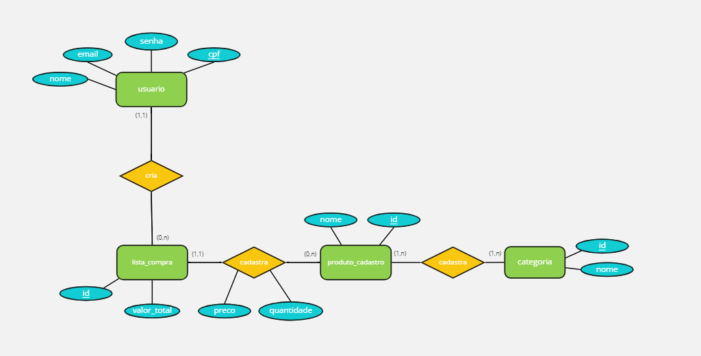
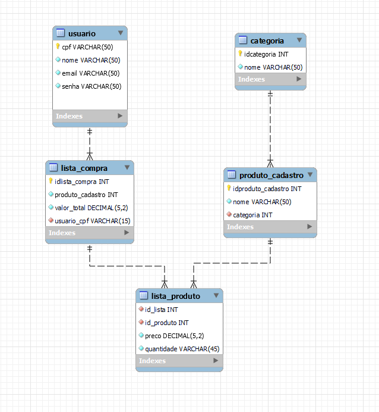

# Arquitetura da Solução

Pré-requisitos: <a href="3-Projeto de Interface.md"> Projeto de Interface</a>

Definição de como o software é estruturado em termos dos componentes que fazem parte da solução e do ambiente de hospedagem da aplicação.

  
*Arquitetura da Solução*

 

## Diagrama de Classes

O diagrama de classes ilustra graficamente como será a estrutura do software, e como cada uma das classes da sua estrutura estarão interligadas. Essas classes servem de modelo para materializar os objetos que executarão na memória.

  
*Diagrama de Classes*

 

## Modelo ER

O Modelo ER representa através de um diagrama como as entidades (coisas, objetos) se relacionam entre si na aplicação interativa.]

  
*Modelo ER*

 

## Esquema Relacional

O Esquema Relacional corresponde à representação dos dados em tabelas juntamente com as restrições de integridade e chave primária.
 
  
*Esquema relacional*

 

## Modelo Físico

Scritps SQL e DML:

<li><a href="src/MinhaCompra/src/services/DbServices.js"> Modelo Físico BD</a></li>
<li><a href="src/MinhaCompra/src/services/DataService.js"> Scripts SQL de DML</a></li>  

 

## Tecnologias Utilizadas

|  Tecnologia | Descrição  | 
| :------------: | :------------ |
| JavaScript|  Linguagem de programação  |
| React Native |  Framework desenvolvimento web | 
| Sqlite |  Banco de dados | 
| Firebase |  Banco de dados | 
| Figma |  Ferramenta de prototipação | 
| Miro |  Ferramenta de colaboração visual | 

  

*Relação entre as tecnologias utilizadas*

 

## Hospedagem  ***ETAPA 5***

Explique como a hospedagem e o lançamento da plataforma foi feita.

> **Links Úteis**:
>
> - [Website com GitHub Pages](https://pages.github.com/)
> - [Programação colaborativa com Repl.it](https://repl.it/)
> - [Getting Started with Heroku](https://devcenter.heroku.com/start)
> - [Publicando Seu Site No Heroku](http://pythonclub.com.br/publicando-seu-hello-world-no-heroku.html)

 

## Qualidade de Software

De acordo com a norma internacional ISO/IEC 25010, as características e subcaracterísticas de qualidade utilizadas como base para nortear o desenvolvimento deste projeto de software e suas respectivas métricas foram:

1- **Funcionalidade**  
 - *Adequação* : Avalia se o software propõe-se a fazer o que é apropriado. Essa métrica será avalida através da entrega dos requisitos funcionais propostos.
 - *Segurança de acesso* : Avalia se é possível o acesso não autorizado a dados. Essa métrica será avaliada através da implementação da autenticação.

2- **Confiabilidade**  
 - *Tolerância a falhas*: Avalia qual a reação decorrente de falhas. Essa métrica será avaliada através dos testes de usabilidade.  
 - *Recuperabilidade*: Avalia se é possível recuperar dados após uma falha. Essa mátrica será avaliada através de monitoramento de uso do app.  

3- **Usabilidade**  
 - *Apreensibilidade*: Avalia se é fácil aprender a usar. Essa métrica será avaliada através de testes de usabilidade.  
 - *Operacionalidade*: Avalia se é fácil de operar e controlar a operação. Essa métrica será avaliada através de testes de usabilidade. 

4- **Eficiência**  
- *Comportamento em relação ao tempo*: Avalia o tempo de resposta e de processamento. Essa métrica será avaliada através de testes de usabilidade. 
- *Comportamento em relação aos recursos*: Avalia quanto recurso utiliza. Essa métrica será avaliada através de testes de usabilidade. 
    
5- **Manutenibilidade**  
- *Modificabilidade*: Avalia se fácil modificar e remover defeitos.Essa métrica será avaliada através da implementação de novas funcionalidades no decorrer do projeto.
- *Testabilidade*: Avalia se fácil testar quando se faz alterações. Essa métrica será avaliada durante o desenvolvimento através do teste das novas implementações.

6- **Portabilidade**  
- *Capacidade para ser instalado*: Avalia se é fácil instalar em outros ambientes. Essa métrica será avaliada após hospedagem em lojas para apps.
- *Capacidade para substituir*: Avalia se está de acordo com padrões ou convenções de portabilidade.Essa métrica será avaliada após investigação de outros apps que possuam funcionalidades semelhantes.

