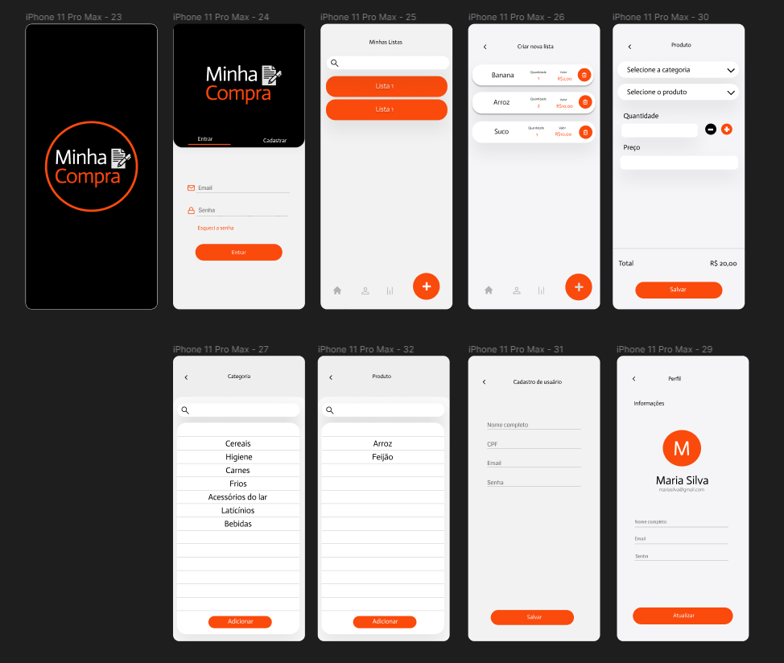

# Template Padrão da Aplicação

Layout padrão da aplicação contendo todos os fluxos de interação com usuário.

> **Link para o protótipo interativo**:
>
> - [Protótipo interativo](https://www.figma.com/proto/hyxuxuUspBHvwszfhaCV6D/Minhas-Compras?node-id=12%3A442&scaling=min-zoom&page-id=0%3A1&starting-point-node-id=12%3A442)
