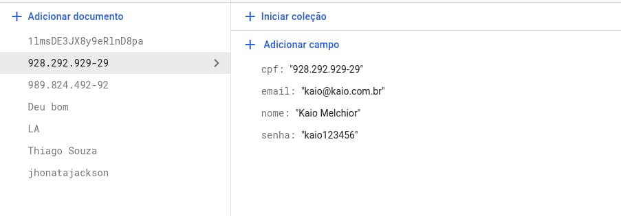
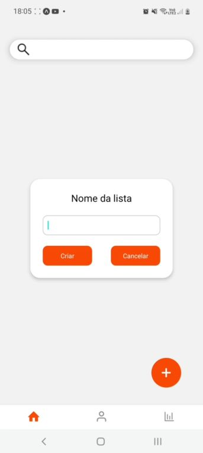
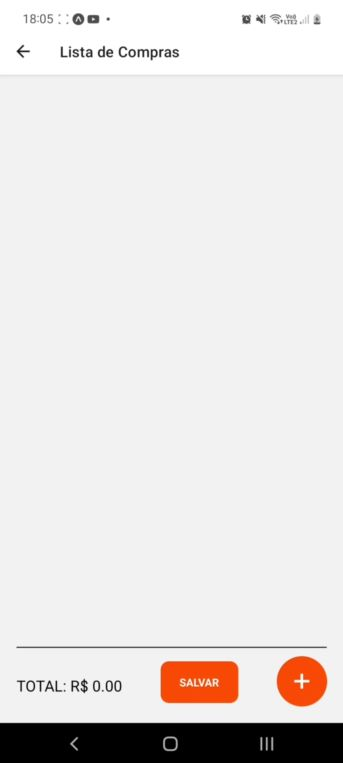
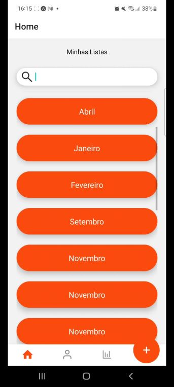
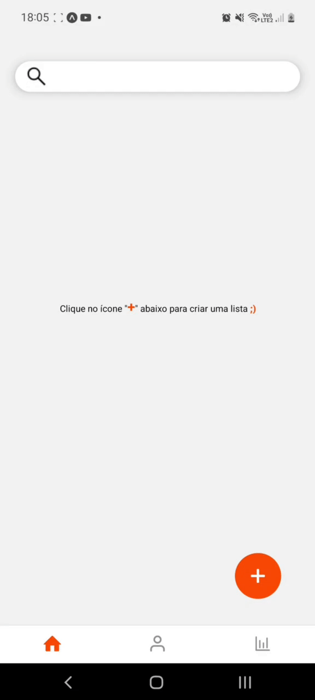
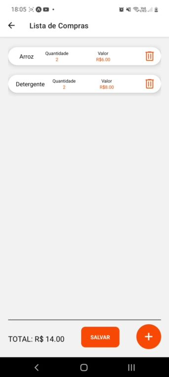
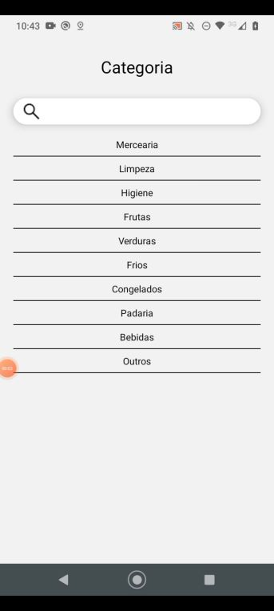
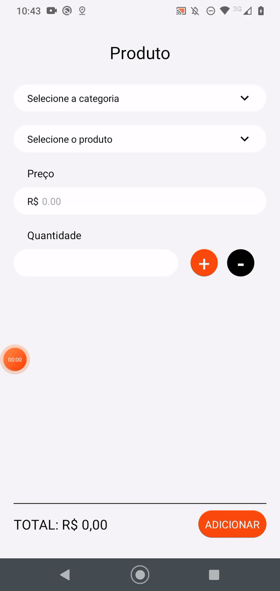

# Programação de Funcionalidades

## - *O aplicativo deve permitir ao usuário cadastrar,atualizar e visualizar os seus dados. (RF-001)* 
  
### - A tela de cadastro será exibida após tela de carregamento, sendo exibido os campos para preenchimento com os dados do usuário.  
### - Após clicar em **Cadastrar**, o usuário terá sua conta salva no banco de dados do Firebase (Firestore) e seus dados poderão ser utilizados na aba **Entrar** para ter acesso ao aplicativo.  
 

  
### - A tela de perfil é onde o usuário poderá visualizar suas informações e alterar seus dados de cadastro e de acesso.  
### - Ao clicar em **Atualizar** os dados serão atualizados na base de dados do Firebase (Firestore).   
 

### ***Requisitos atendidos***  
- RF-001  
 

### ***Artefatos criados***
**Views**  
<li><a href="https://github.com/ICEI-PUC-Minas-PMV-ADS/pmv-ads-2022-2-e3-proj-mov-t3-minha-compra/blob/develop/src/MinhaCompra/src/views/Login.js"> Login</a></li>
<li><a href="https://github.com/ICEI-PUC-Minas-PMV-ADS/pmv-ads-2022-2-e3-proj-mov-t3-minha-compra/blob/develop/src/MinhaCompra/src/views/Profile.js"> Profile</a></li>  
 

**Componentes**
<li><a href="https://github.com/ICEI-PUC-Minas-PMV-ADS/pmv-ads-2022-2-e3-proj-mov-t3-minha-compra/blob/develop/src/MinhaCompra/src/components/LoginInput.js"> LoginInput</a></li>
<li><a href="https://github.com/ICEI-PUC-Minas-PMV-ADS/pmv-ads-2022-2-e3-proj-mov-t3-minha-compra/blob/develop/src/MinhaCompra/src/components/SignUpInput.js"> SignUpInput</a></li>
 

**Services**
<li><a href="https://github.com/ICEI-PUC-Minas-PMV-ADS/pmv-ads-2022-2-e3-proj-mov-t3-minha-compra/blob/develop/src/MinhaCompra/src/services/DataService.js"> DataService</a></li>
<li><a href="https://github.com/ICEI-PUC-Minas-PMV-ADS/pmv-ads-2022-2-e3-proj-mov-t3-minha-compra/blob/develop/src/MinhaCompra/src/services/DbServices.js"> DbServices</a></li>
 

### ***Instruções de acesso Cadastrar***  
1- Acesse a tela inicial do aplicativo  
2- Clique na aba *Cadastrar*  
3- Preencha **nome, cpf, email e senha**  
4- Clique no botão *Cadastrar*  
 

### ***Instruções de acesso Atualizar***  
1- Acesse a tela *Profile*  
2- Atualize o **nome, email ou senha (cpf não poderá ser atualizado pois é chave primária)**  
3- Clique no botão *Atualizar*  
4- *Observação: É necessário que o usuário faça logout se forem alterados email e senha, porquê o token de acesso ficará inválido*
 

    

 

### ***Alertas ao Atualizar***  
1- Por favor, digite um email válido.  
2- A senha deve ter, pelo menos, 6 caracteres.

 

### ***Antes e depois atualização no Firebase (Firestore)***

 

## - *O aplicativo deve permitir ao usuário logar/deslogar da sua conta. (RF-002)* 

  
### - A tela de *Login* será exibida após tela de carregamento, sendo exibido os campos para preenchimento com os dados de acesso.
### - Ao clicar em *Entrar*, o usuário terá sua conta autenticada e salva no banco de dados do Firebase (Authentication) e logo terá acesso ao aplicativo.  
 

### ***Requisitos atendidos***  
- RF-002  
 

### ***Artefatos criados***
**Views**  
<li><a href="https://github.com/ICEI-PUC-Minas-PMV-ADS/pmv-ads-2022-2-e3-proj-mov-t3-minha-compra/blob/develop/src/MinhaCompra/src/views/Login.js"> Login</a></li>
 

**Componentes**
<li><a href="https://github.com/ICEI-PUC-Minas-PMV-ADS/pmv-ads-2022-2-e3-proj-mov-t3-minha-compra/blob/develop/src/MinhaCompra/src/components/LoginInput.js"> LoginInput</a></li>
 

**Services**
<li><a href="https://github.com/ICEI-PUC-Minas-PMV-ADS/pmv-ads-2022-2-e3-proj-mov-t3-minha-compra/blob/develop/src/MinhaCompra/src/services/DataService.js"> DataService</a></li>
<li><a href="https://github.com/ICEI-PUC-Minas-PMV-ADS/pmv-ads-2022-2-e3-proj-mov-t3-minha-compra/blob/develop/src/MinhaCompra/src/services/DbServices.js"> DbServices</a></li>
 

### ***Instruções de acesso Login***  
1- Acesse a tela inicial do aplicativo  
2- Clique na aba *Entrar*  
3- Preencha **email e senha**  
4- Clique no botão *Entrar*  
 

    

 

### ***Firebase (Authentication)***

 

## - *O aplicativo deve permitir ao usuário cadastrar novas listas, assim como visualizar, alterar e excluir as listas de compras anteriores. (RF-003)*  
 
 

### - A tela de *Lista* será exibida após clique no botão '+' no canto da tela principal.  

### - Após definição do *Nome da lista*, e adicionados os *produtos*, o usuário poderá alterar os itens clicando sobre o campo de cada item contido na lista, e até mesmo deletá-lo utilizando o botão 'lixeira'.  
 

  

### - A tela de *Minhas Listas* será exibida após clique no botão 'home' no canto esquerdo da tela principal. 
### - Através da caixa de pesquisa a lista desejada pode ser encontrada pelo nome escolhido anteriormente.  
 

### ***Requisitos atendidos***  
- RF-003 
 

### ***Artefatos criados***
**Views**  
<li><a href="https://github.com/ICEI-PUC-Minas-PMV-ADS/pmv-ads-2022-2-e3-proj-mov-t3-minha-compra/blob/develop/src/MinhaCompra/src/views/Home.js"> Home</a></li>
<li><a href="https://github.com/ICEI-PUC-Minas-PMV-ADS/pmv-ads-2022-2-e3-proj-mov-t3-minha-compra/blob/develop/src/MinhaCompra/src/views/Lista.js"> Lista</a></li>
 

**Componentes**
<li><a href="https://github.com/ICEI-PUC-Minas-PMV-ADS/pmv-ads-2022-2-e3-proj-mov-t3-minha-compra/blob/develop/src/MinhaCompra/src/components/NewProductAtList.js"> NewProductAtList</a></li>
<li><a href="https://github.com/ICEI-PUC-Minas-PMV-ADS/pmv-ads-2022-2-e3-proj-mov-t3-minha-compra/blob/develop/src/MinhaCompra/src/components/SearchBar.js"> SearchBar</a></li>
 

**Services**
<li><a href="https://github.com/ICEI-PUC-Minas-PMV-ADS/pmv-ads-2022-2-e3-proj-mov-t3-minha-compra/blob/develop/src/MinhaCompra/src/services/DataService.js"> DataService</a></li>
<li><a href="https://github.com/ICEI-PUC-Minas-PMV-ADS/pmv-ads-2022-2-e3-proj-mov-t3-minha-compra/blob/develop/src/MinhaCompra/src/services/DbServices.js"> DbServices</a></li>
 

### ***Instruções de acesso Minhas Listas***  
1- Acesse a tela inicial do aplicativo;  
2- Clique no ícone *Home*;  
3- Acesse suas listas cadastradas.
 

### ***Instruções de acesso Lista***  
1- Acesse a tela inicial do aplicativo  
2- Clique no botão '+';  
3- Insira o *Nome da lista* e clique em *Criar*;  
4- Selecione o *Produto* e clique em *Adicionar*;  
5- Retorne em *Lista* para visualizar os produtos adicionados.  
6- Clique em *Salvar* para finalizar a lista e acesar demais listas cadastradas. 
 

    

 
 

    

 

## - *O aplicativo deve permitir ao usuário cadastrar, visualizar, atualizar e deletar os itens de sua lista de compras. (RF-004)*    
  
### - A tela de *Lista de compras* é onde visualizamos os itens adicionados na tela *Produto*.
### - A partir do ícone de *lixeira* o produto é deletado da lista.
### - Caso deseja atualizar o produto, ao clicar acima do seu card, será direcionado à tela de *Produto*.
 

### ***Requisitos atendidos***  
- RF-004 
 

### ***Artefatos criados***
**Views**  
<li><a href="https://github.com/ICEI-PUC-Minas-PMV-ADS/pmv-ads-2022-2-e3-proj-mov-t3-minha-compra/blob/develop/src/MinhaCompra/src/views/Lista.js"> Lista</a></li>
 

**Componentes**
<li><a href="https://github.com/ICEI-PUC-Minas-PMV-ADS/pmv-ads-2022-2-e3-proj-mov-t3-minha-compra/blob/develop/src/MinhaCompra/src/components/NewProductAtList.js"> NewProductAtList</a></li>
<li><a href="https://github.com/ICEI-PUC-Minas-PMV-ADS/pmv-ads-2022-2-e3-proj-mov-t3-minha-compra/blob/develop/src/MinhaCompra/src/components/Lists.js"> Lists</a></li>
 

**Services**
<li><a href="https://github.com/ICEI-PUC-Minas-PMV-ADS/pmv-ads-2022-2-e3-proj-mov-t3-minha-compra/blob/develop/src/MinhaCompra/src/services/DataService.js"> DataService</a></li>
 

### ***Instruções de acesso Itens da Lista de compras***  
1- Acesse a tela inicial do aplicativo  
2- Clique no botão '+';  
3- Insira o *Nome da lista* e clique em *Criar*;  
4- Selecione o *Produto* e clique em *Adicionar*;  
5- Retorne em *Lista de compras* para visualizar os produtos adicionados.  
6- Para deletar o produto, clique no ícone de *lixeira*.  
7- Para atualizar o item, clique sobre o produto e altere o que desejar.  
8- Clique em *Adicionar* para salvar alteração.
 

    

 

## - *O aplicativo deve permitir ao usuário cadastrar informações de produtos. (RF-005)*
## - *O aplicativo deve permitir ao usuário cadastrar, visualizar e atualizar o preço dos produtos. (RF-006)*  
  
### - A tela de cadastro de produto é onde definimos o *tipo* do produto e sua *categoria*. 
### - O *preço* e sua *quantidade* podem ser definidos e o *total* é atualizado conforme cálculo do aplicativo.
 

  
### - A partir do modal *tipo*, este pode ser selecionado pelo usuário.  
### - Esses tipos estão contidos na base de dados Sqlite.
 

  
### - A partir do modal *categoria*, esta pode ser selecionado pelo usuário.  
### - Essas categorias estão contidos na base de dados Sqlite.
 

### ***Requisitos atendidos***  
- RF-005  
- RF-006  
 

### ***Artefatos criados***
**Views**  
<li><a href="https://github.com/ICEI-PUC-Minas-PMV-ADS/pmv-ads-2022-2-e3-proj-mov-t3-minha-compra/blob/develop/src/MinhaCompra/src/views/Produto.js"> Produto</a></li>
 

**Componentes**
<li><a href="https://github.com/ICEI-PUC-Minas-PMV-ADS/pmv-ads-2022-2-e3-proj-mov-t3-minha-compra/blob/develop/src/MinhaCompra/src/components/SearchBar.js"> SearchBar</a></li>
 

**Services**
<li><a href="https://github.com/ICEI-PUC-Minas-PMV-ADS/pmv-ads-2022-2-e3-proj-mov-t3-minha-compra/blob/develop/src/MinhaCompra/src/assets/data/default_data.js"> default_data</a></li>
 

### ***Instruções de acesso Cadastrar***  
1- Acesse a aba Produto do aplicativo;  
2- Clique na aba *tipo* e selecione um setor;  
3- Clique na aba *categoria* e selecione um nome;  
4- Preencha o **preço** e a **quantidade** *(ajustável através dos botões '+' e '-')*;  
5- Confira o total calculado pelo app;  
6- Clique no botão *Adicionar* para o produto fazer parte de sua lista de compras.  
 

    

 

