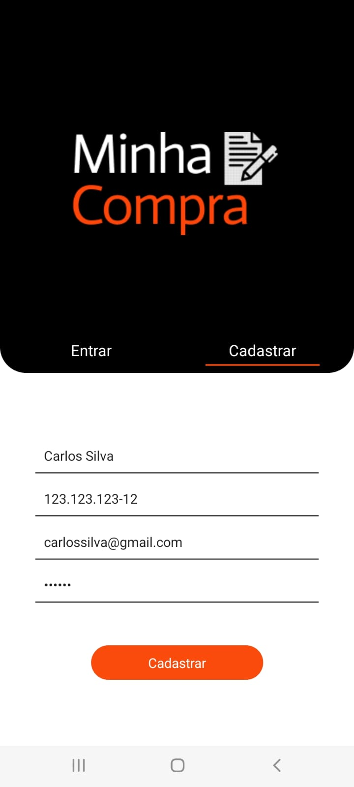
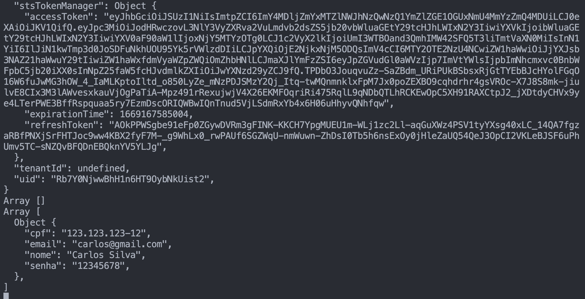
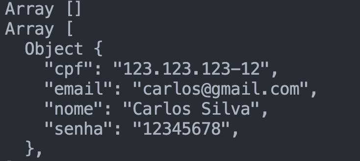
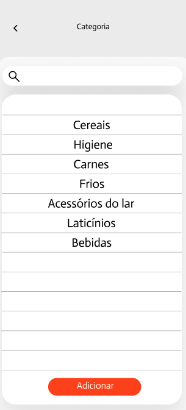
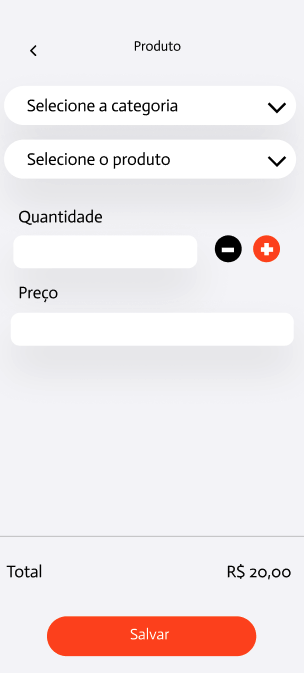
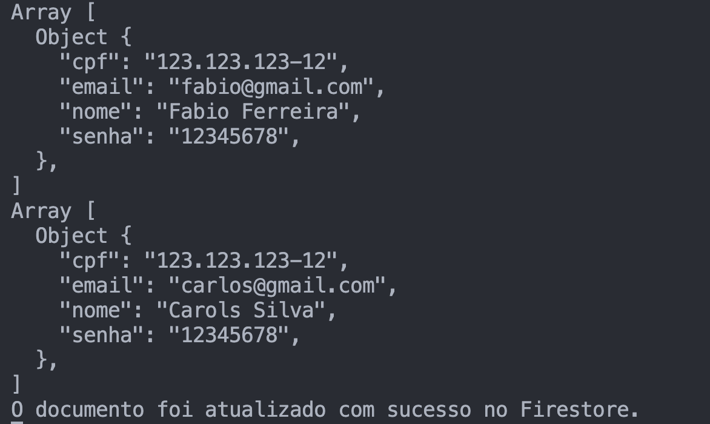

# Registro de Testes de Software

Tabela de resumo com os resultados dos testes.

|  Caso de teste | Descrição  | Resultado |
| :------------: | :------------ |:------------: |
| CT-01 |  Cadastramento de usuário  | Sucesso|
| CT-02 |  Consulta de dados | Sucesso|
| CT-03 |  Criação de uma nova lista | Sucesso|
| CT-04 |  Acessar lista existente  | Sucesso|
| CT-05 |  Alterar lista existente  | Sucesso|
| CT-06 |  Alterar dados do usuário  | Sucesso|

## CT-01- Cadastramento de usuário

Conforme o CT-01, o teste foi executado com sucesso. Todas os campos preecnhidos e enviados, são armazenados e dado como salvo com sucesso.

[

## CT-02- Consulta de dados

Conforme o CT-02, o teste foi executado com sucesso. Ao consultar as informações do usuário, o resultado é exibido.

## CT-03- Criação de uma nova lista

Conforme o CT-03, o teste foi executado com sucesso. após criar uma nova lista, a página de informções detalhadas é exibida. 

## CT-04- Acessar lista existente

Conforme o CT-04, o teste foi executado com sucesso. É possível acessar uma lista já existente, clicar no botão de vizualizar e exibir todas as informações preenchidas. 

## CT-05- Alterar lista existente

Conforme o CT-05, o teste foi executado com sucesso. Ao alterar algum campo da lista já existente, é possível  salvar, a mensagem de atualizado com sucesso é exibida, e as informações atualizadas.

## CT-06- Alterar dados do usuário

Conforme o CT-06, o teste foi executado com sucesso. A opção de acessar os dados do usuário e realizar modificações é funcional, a mensagem de atualizado com sucesso é exibida.

## Avaliação

Todos os testes foram executados com sucesso conforme o plano de teste proposto. Tanto o front-end, quando o back-end tiveram uma boa integração para que os resultados fossem alcançados.
