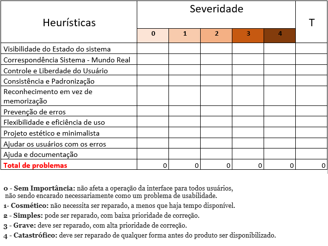

# Plano de Testes de Usabilidade
## Avaliação Dinâmica (feita pelo usuário que faz as transações - casos de uso)

> - Objetivo do teste: Avaliar a usabilidade do software  

> - Quando e onde o teste será executado: Online 

> - Tempo de duração para cada sessão de teste: 20 minutos 

> - Estado em que o software deve estar no início do teste: Fase de protótipo (em construção) 

> - Usuários envolvidos no teste: Pessoas que realizam compras e tem acesso a um smartphone. 

 
> - Tarefas definidas para que os usuários executem 

## Realizar os procedimentos das seguintes funcionalidades:  

### Usuário

1)  *Cadastrar Perfil* : Realizar o preenchimento dos campos de *nome*, *CPF*, *e-mail* e *senha* da página de cadastro. Após preenchimento de todos os campos requeridos, o usuário irá clicar no botão SALVAR.  

2)  *Cosultar Perfil* : Ver informações referentes ao seu perfil, sendo: *nome*, *e-mail* e *senha*.

3)  *Atualizar Perfil* : Atualizar informações referentes ao seu perfil, sendo: *nome*, *e-mail* e *senha*. 

4) *Logar Perfil* : Realizar login no app através do *nome* e *senha*.

### Listas

1) *Cadastrar Listas* : Realizar cadastro de listas, colocando: *produto*, *quantidade* e *valor*.

2) *Consultar Listas* : Realizar consulta da lista ao clicar na lista em questão.

3) *Atualizar Listas* : Realizar atualização da lista ao clicar na lista em questão.

4) *Deletar Produto da Lista* : Deletar produto da lista ao clicar no ícone de *lixeira* que se encontra do lado do campo *valor*.

5) *Deletar Lista* : Deletar lista ao clicar e segurar na lista que quiser deletar. Após isso, aparecerá um modal para deletar a mesma.

## Produtos

1) *Adicionar Produto na Lista* : Adicionar produto na lista, após preencher os campos: *categoria*, *produto*, *quantidade* e *preço*.

2) *Cadastrar Novo Produto* : Adicionar um novo produto ao clicar no ícone de *+* que aparecerá no dropdown da lista de produto. Necessário colocar o *nome* e *categoria* do produto.

3) *Cadastrar Nova Categoria* : Adicionar uma nova categoria clicar no ícone de *+* que aparecerá no dropdown da lista de categoria. Necessário preencher o campo *nome*.

### Quais são as funcionalidades mais críticas: 

* Cadastrar um novo usuário
* Cadastrar uma nova lista
* Cadastrar um novo produto
* Cadastrar uma nova categoria

## Dados que serão coletados durante os testes: 

Serão avaliados por nota, segundo as seguintes métricas: 

Nota 1-  Péssimo (refazer funcionalidade) 

Nota 2-  Ruim (refazer uma parte da funcionalidade) 

Nota 3-  Mediano (alterações pontuais) 

Nota 4-  Muito bom (experimentar e iterar) 

Nota 5-  Excelente (pronto para testar em produção) 

&nbsp;

## Avaliação Estática (Heuríticas de Nielsen)

### Teste de Usabilidade (Heurísticas)

De uma forma geral, a heurística tem como objetivo reduzir a carga cognitiva do usuário, diminuindo o tempo de tomada de decisão fazendo com que as experiências sejam mais apropriadas e menos cansativas.

**1- Visibilidade do status do sistema**

Manter o usuário informado sobre o que acontece no momento da interação, podendo mostrar, por exemplo, as listas já criadas e os produtos já adicionados

**2-Correspondência entre o sistema e o mundo real**

O reconhecimento de objetos e ícones que são familiares é muito importante para experiência do usuário, que fale a linguagem mais próxima de sua realidade, ícones como o símbolo de telefone ou uma carta que representa o e-mail.

**3-Liberdade e controle do usuário**

Considerando que o usuário pode tomar uma ação errada ou se arrepender da decisão que tomou, o sistema pode lhe dar a opção de voltar ou mesmo mostrar um aviso sobre à ação que será feita.

**4-Consistência e padrões**

Manter uma mesma linguagem durante toda a interface para não confundir o usuário, portanto, durante a interação, os usuários não devem ter dúvidas sobre o significado das palavras, ícones ou símbolos utilizados, é fundamental que uma interface mantenha padrões de interação em diversos contextos.

**5-Prevenção de erros**

Para prevenirmos que o usuário não se frustre ao ter os listas deletadas, é importante criar uma mensagem de aviso da ação, para que haja a confirmação ou não da decisão.

**6- Reconhecer ao invés de lembrar**

O usuário não deve ter que se lembrar de todas as ações ou funções da interface é importante sempre deixar à disposição pequenos lembretes das informações que podem ser úteis a ele, como um símbolo de interrogação e ao clicar irá mostrar alguma informação.

**7-Flexibilidade e eficiência**

A interface desenvolvida precisa ser útil e atender tanto aos usuários inexperientes quanto aos experiêntes.

**8-Estética e Design minimalista**

A interface deve conter diálogos que contenham somente informações relevantes. Ou seja, evitar o uso desnecessário de elementos visuais que possam confundir o usuário.

**9-Auxiliar usuários a reconhecer, diagnosticar e recuperar erros**

É muito importante ajudar o usuário a identificar e encontrar soluções para os problemas e erros encontrados durante a interação. As mensagens de erro devem ser mostradas em uma linguagem simples, sem códigos, clara e que indique precisamente o problema e sugira uma solução.

**10- Ajuda e documentação**

Pode ser necessário fornecer documentação para ajudar os usuários a entender como concluir suas tarefas. O conteúdo de ajuda e documentação deve ser fácil de pesquisar e focado na tarefa do usuário.

Abaixo a tabela mostra como realizar um teste de usabilidade atrvés de pontuação.

